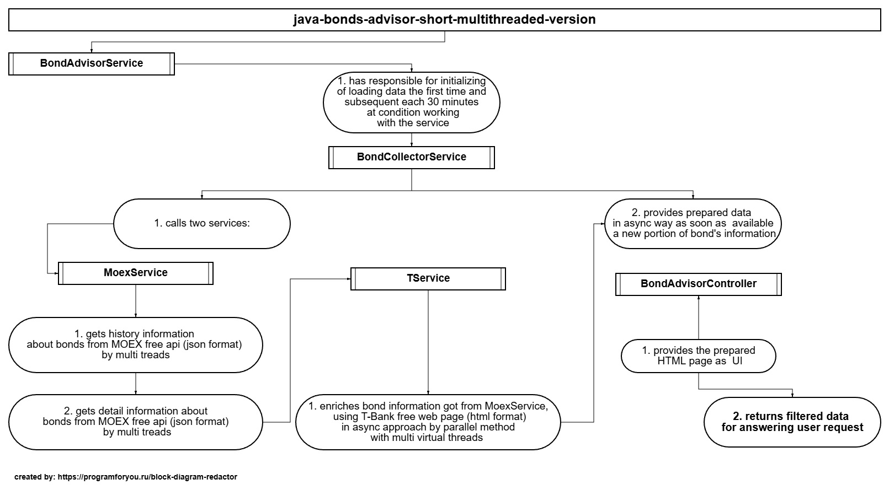
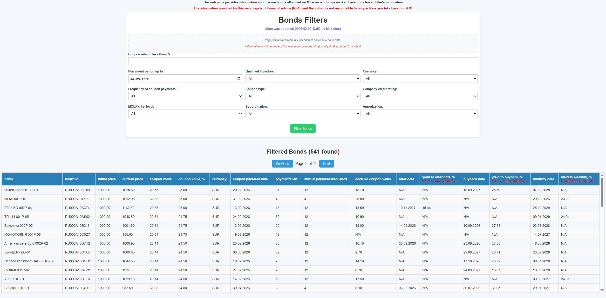

## Java-Bond-Adviser-Short-Multithreaded-Version
**⚠️Not for commercial use!**
### 1. Description:
A Spring Boot application that aggregates bond market data, filters it by coupon yield (highest to lowest), and presents it in real-time.

**Key Features:**
- **Asynchronous Data Processing:** Uses `CompletableFuture` for non-blocking data retrieval
- **Parallel Processing:** Leverages multi-threading and virtual threads (Java 21) for improved performance
- **Incremental Data Delivery:** Returns bond data in batches as soon as available
- **Automated Updates:** Refreshes data on first load and every 30 minutes thereafter
- **Comprehensive Testing:** 80% code coverage with JUnit 5, Mockito, and JaCoCo

**Performance Note:** Data update speed varies based on hardware specifications and network conditions.
### 2. Simple schema of inner interaction of the app components

### 3. Sample of the main page

### 4. How to run the application

#### **Prerequisites:**
- Java 21 JDK
- Maven 3.8+
- Windows 10 or higher, macOS, or Linux

#### **Option A: Windows Executable (Windows 10 or higher)**
1. Just follow the link on a zip archive with the app: 
   [JavaBondAdviserShortMultithreadedVersion](https://github.com/AlexKlinkov/java-bond-adviser-short-multithreaded-version/releases/tag/JavaBondsAdvisorShortMultithreadedVersion_v1.0)

#### **Option B: From Source (All Platforms)**
1. Download the archive with **Java-Bond-Adviser-Short-Multithreaded-Version**
2. Unzip it, where you need
3. Open your **terminal:**
4. Pass to the unzipped directoria, where **pom.xml** file is located. An example command for windows: **cd C:\advisor**
5. Use **mvn.cmd** for run the app. An example command for windows: **C:\maven\lib\maven3\bin\mvn.cmd spring-boot:run**
6. Now you can open the main page of the app in your browser: http://127.0.0.1:8081/bonds/list

**Access the application:**
1. Main Interface: http://127.0.0.1:8081/bonds/list
2. API Documentation: http://127.0.0.1:8081/swagger-ui/index.html

* **
### 5. Technology stack
| Category | Technology | Version | Purpose                               |
|----------|------------|---------|---------------------------------------|
| **Language** | Java | 21 | LTS with virtual threads              |
| **Framework** | Spring Boot | 3.4.2 | Rapid application development         |
| **Reactive** | Spring WebFlux | 6.2.2 | HTTP client                           |
| **Templating** | Thymeleaf | 3.1.3 | HTML server-side rendering            |
| **API Docs** | SpringDoc OpenAPI | 2.7.0 | API documentation (Swagger)           |
| **HTML Parsing** | Jsoup | 1.16.1 | Web scraping HTML content             |
| **JSON Processing** | Gson | 2.11.0 | JSON serialization/deserialization    |
| **Object Mapping** | MapStruct | 1.5.3 | Object mapping                        |
| **Utilities** | Lombok | 1.18.34 | Code generation (reduces boilerplate) |
| **Testing** | JUnit 5 | 5.11.4 | Unit testing framework                |
| **Mocking** | Mockito | 5.14.2 | Test mocking framework                |
| **Coverage** | JaCoCo | 0.8.12 | Code coverage reporting               |
| **Build Tool** | Maven | 3.8+ | Dependency & build management         |